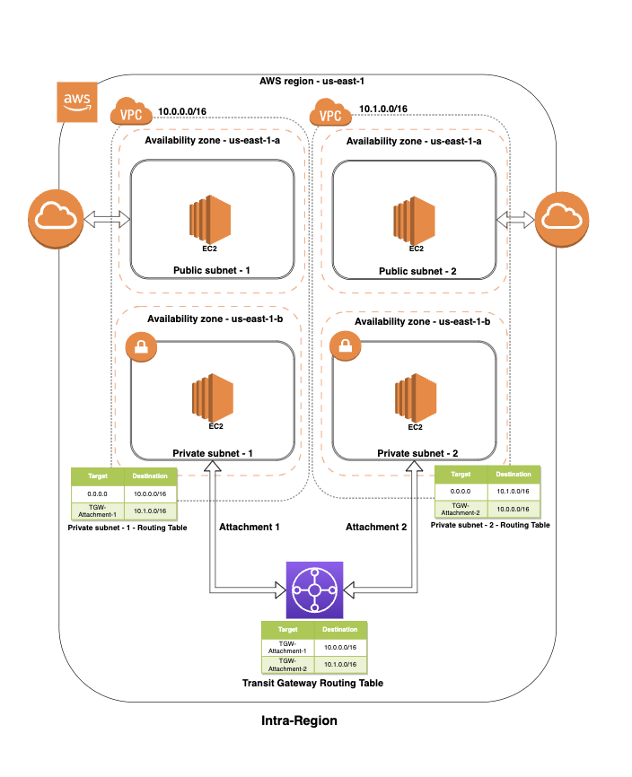
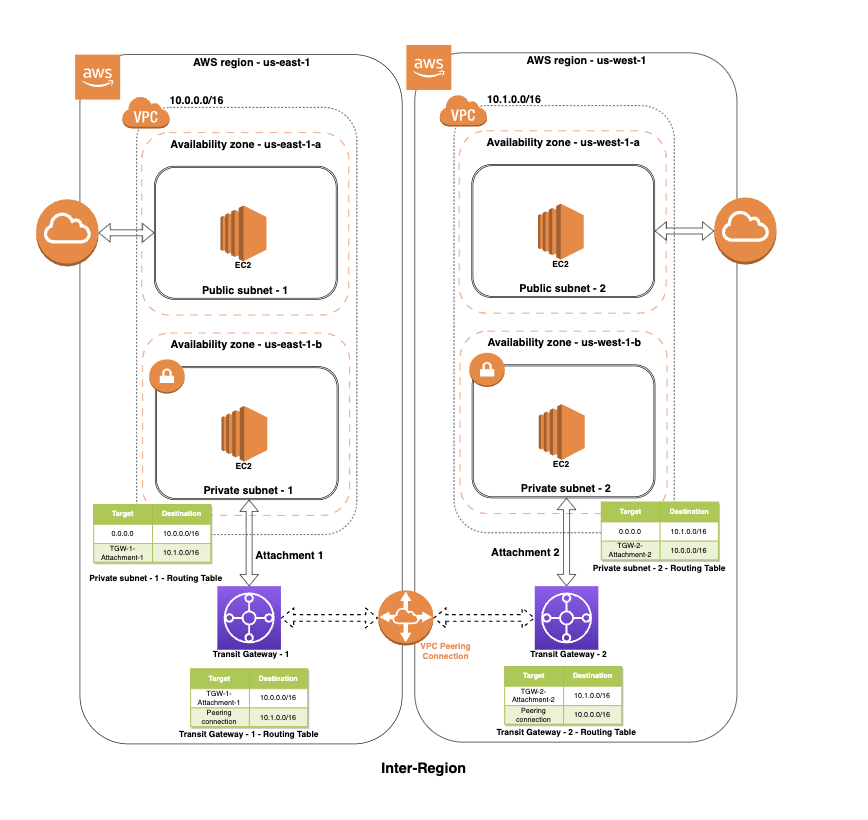
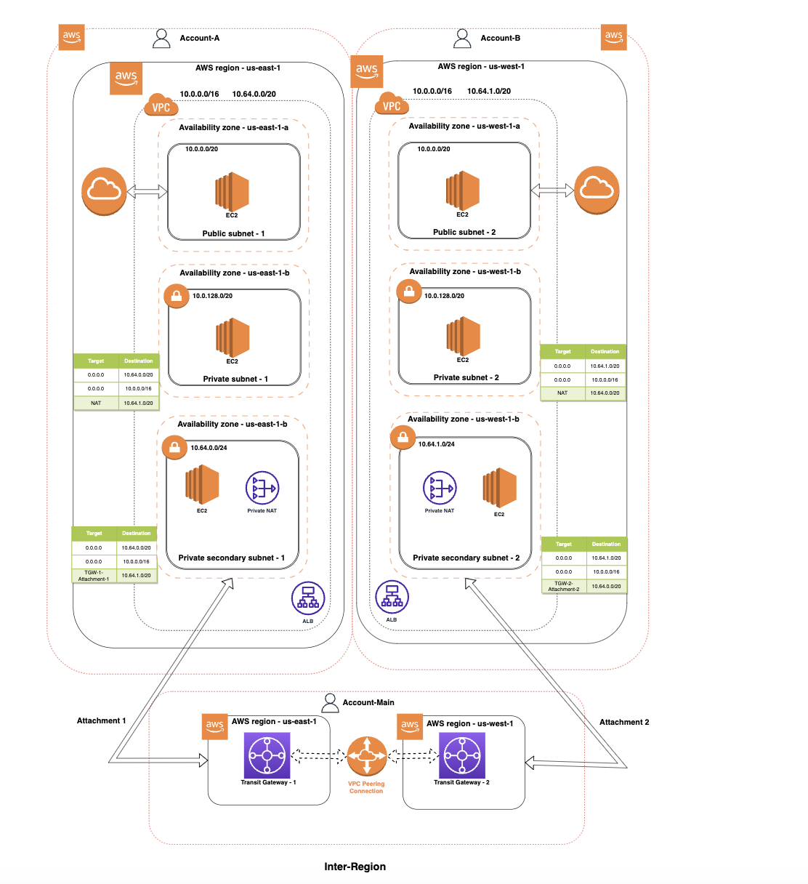

# nsp-multicloud-network

## Scenario 1:
### Intra Region

## Scenario 2 - Inter Region:

## Across accounts

How to run?

1. The folder `run` has the files for each scenario. ( intra-region, inter-region )
2. The folder `services` has the functions which are used for creating the required services
